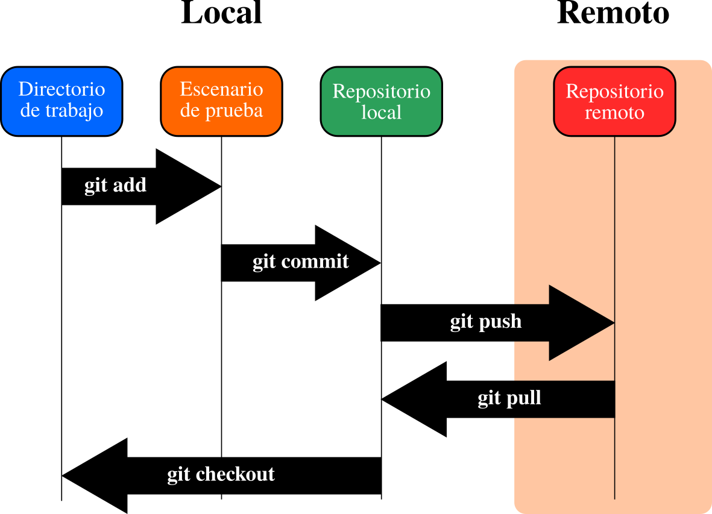

## Repositorio de Física 3 unsam
Acá pretendemos escribir algunos de los lineamientos para las prácticas de laboratorio y los informes que tienen que realizar los estudiantes

### Algunos comandos para git
Algunos comandos para una carpeta que ya tenemos con archivos
1. Abrimos una terminal en esa carpeta y tipeamos
```console
foo@bar:~$ git init
```
2. Con esto hemos iniciado el repositorio. Aquí un breve esquema de como es el flujo de trabajo en este sistema de versionado. Tenemos tres instancias una el direcotrio de trabajo, luego el index que es una zona intermedia y finalmente el commit que nos deja con la "última versión" del proyecto.


3. Una vez que iniciamos el repositorio pasamos a agregar los archivos en los que hemos estado trabajando. Lo hacemos mediante el comando add,
```console
foo@bar:~$ git add .
```

4. Cuando estamos conformes con el nivel de desarrollo logrado podemos actualizar todo el repositorio y establecer una nueva versión de nuestro proyecto. Para ello recurrimos al comando commit. No olvidar de hacer una breve descripción de la nueva versión, en el editor de texto que se despliega.
```console
foo@bar:~$ git commit -m
```

5. Finalmente, podemos actualizar nuestro repositorio remoto en caso que lo tengamos. Lo primero es agregar la dirección de tal repositorio, que se realiza de la siguiente manera
```console
foo@bar:~$ git remote add origin https://github.com/mrisaro/fisica3_unsam.git
```
6. Por último, actualizamos todo que tengamos en nuestro repositorio local hacia el repositorio remoto con el comando push.
```console
foo@bar:~$ git push -u origin master
```
